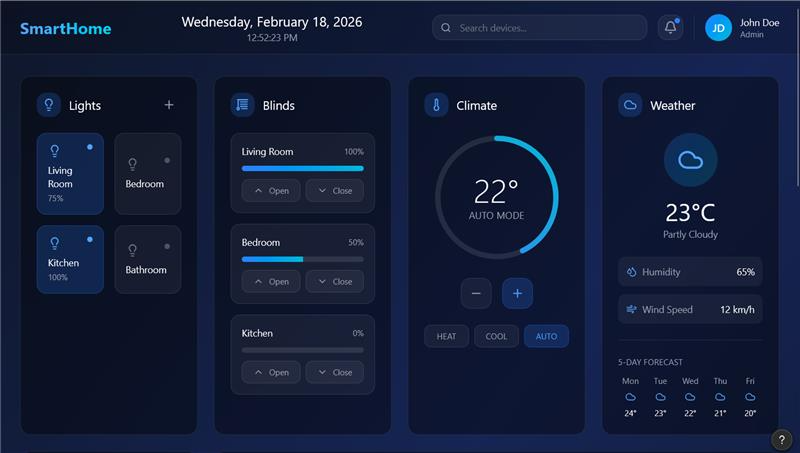
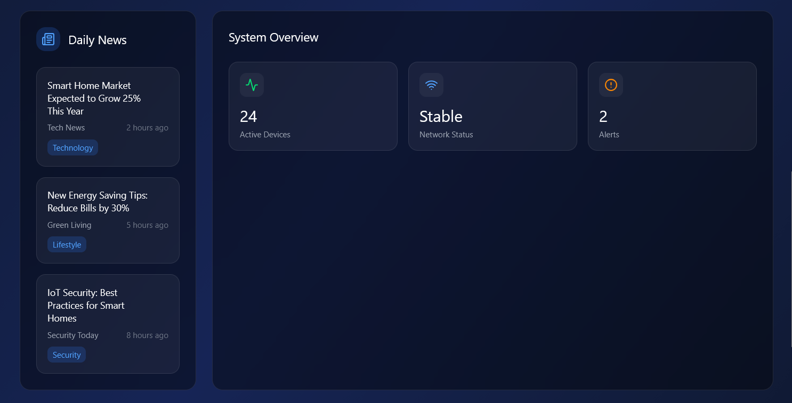
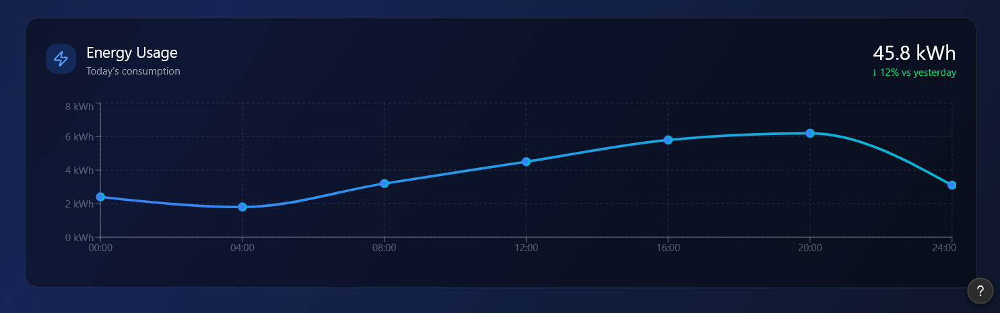

# 🏠 SMARTHOME

Application Desktop de gestion d'appareils connectés développée avec Electron en architecture MVVM.

---
## 📄 Auteur
ANDRIANASOLOHARISON Tsiory
El  KAROUI Yael ()
Kouakou Elie Marc


## 📄 Description

SMARTHOME permet d’afficher et contrôler les appareils connectés d’une maison intelligente via une interface desktop moderne.

---

## ⚙️ Fonctionnalités

- [x] Affichage des appareils connectés
- [x] Contrôle ON/OFF
- [x] Notification Windows native
- [ ] Synchronisation temps réel (à venir)

---

## 🏗 Architecture

Architecture MVVM :

- Model → Device
- View → HTML/CSS
- ViewModel → Logique UI
- Main Process → Backend Electron

---

## 🛠 Stack Technique

- Electron
- Node.js
- HTML / CSS
- JavaScript

---

## 🚀 Installation

```bash
git clone https://github.com/Riantsoa11/SmartHome.git
cd SmartHome
npm install
npm install electron --save-dev
npm start


##  Design




