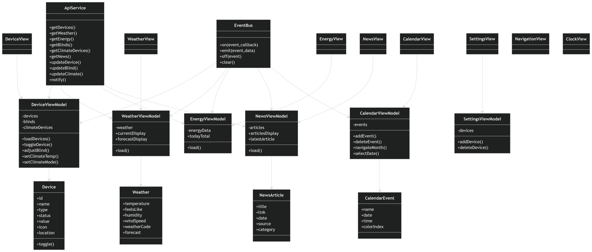

# 🏠 SmartHome

Application Desktop de gestion d'appareils connectés développée avec **Electron** en architecture **MVVM**.

[](https://electronjs.org/)
[](https://developer.mozilla.org/en-US/docs/Web/JavaScript)
[](https://en.wikipedia.org/wiki/Model%E2%80%93view%E2%80%93viewmodel)
[](https://opensource.org/licenses/ISC)

---

## 👥 Auteur

**Tsiory Riantsoa**  
[](https://github.com/Riantsoa11)
[](https://linkedin.com/in/riantsoa11)

---
## 📄 Auteur
ANDRIANASOLOHARISON Tsiory
El  KAROUI Yael ()
Kouakou Elie Marc


## 📄 Description

**SmartHome** est une application desktop moderne permettant d'afficher et de contrôler les appareils connectés d'une maison intelligente via une interface simple et élégante.

L'objectif principal de l'application est de fournir une interface centralisée pour gérer des objets connectés tout en illustrant l'utilisation d'une **architecture MVVM** dans une application **Electron**.

### 🎯 Objectifs du Projet

- ✅ Démontrer l'architecture MVVM dans un contexte Electron
- ✅ Fournir une interface utilisateur moderne et responsive
- ✅ Intégrer des APIs externes (météo, actualités)
- ✅ Implémenter des notifications système natives
- ✅ Gérer l'état des appareils en temps réel

---

## ⚙️ Fonctionnalités

### 🏠 Tableau de Bord
- **Horloge temps réel** avec affichage digital
- **Badge de connexion** indiquant le statut en ligne
- **Navigation intuitive** entre les différentes sections

### 💡 Gestion des Appareils
- Affichage des appareils connectés (lumières, climatisation, son)
- **Contrôle ON/OFF** des appareils
- **Réglage des valeurs** (température, volume, etc.)
- **Notifications Windows natives** lors des changements d'état
- Support pour appareils personnalisés

### 🌤️ Météo
- **Conditions météorologiques actuelles**
- **Prévisions sur 7 jours**
- **Graphique des températures horaires**
- **Informations détaillées** (humidité, vent, ressenti)
                        
### ⚡ Suivi Énergétique
- **Consommation horaire** avec graphique en barres
- **Statistiques mensuelles** et quotidiennes
- **Estimation des coûts** et économies réalisées
- **Comparaison avec la veille**

### 📰 Actualitées
- **Flux d'actualités** intégré
- **Articles triés par date** (plus récent en premier)
- **Gestion d'erreurs** en cas de problème de chargement

### 📅 Calendrier
- **Calendrier mensuel** interactif
- **Gestion d'événements** locaux (stockage localStorage)
- **Navigation** entre les mois
- **Ajout/Suppression d'événements**

### ⚙️ Paramètres
- **Configuration de l'application**
- **Réglages utilisateur**
- **Options de personnalisation**

---

## 🏗️ Architecture

L'application utilise le pattern **MVVM (Model View ViewModel)** pour séparer clairement la logique métier, l'interface utilisateur et les données.

### Structure MVVM

| Composant | Description | Technologies |
|-----------|-------------|--------------|
| **Model** | Représentation des données et logique métier | Classes JavaScript ES6 |
| **View** | Interface utilisateur et présentation | HTML5, CSS3, Vanilla JS |
| **ViewModel** | Logique d'interaction entre Vue et Modèle | Classes JavaScript avec EventBus |
| **Main Process** | Backend Electron et IPC | Electron APIs, Node.js |

### Architecture Technique

```
📁 SmartHome/
├── 📄 main.js              # Processus principal Electron
├── 📄 preload.js           # Pont de communication sécurisé
├── 📄 package.json         # Configuration et dépendances
├── 📁 src/
│   ├── 📁 models/          # Classes de données (Device, Weather, etc.)
│   ├── 📁 views/           # Templates HTML et composants UI
│   ├── 📁 viewmodels/      # Logique de présentation
│   └── 📁 services/        # Services utilitaires (API, EventBus)
└── 📁 assets/              # Ressources statiques
```

Voici le diagramme de classe du projet


### Communication Inter-Processus

- **IPC (Inter-Process Communication)** pour la communication sécurisée
- **EventBus** pour la communication interne entre ViewModels
- **Context Isolation** activé pour la sécurité

---

## 🚀 Installation & Utilisation

### Prérequis

- **Node.js** (version 16 ou supérieure)
- **npm** ou **yarn**
- **Windows 10/11** (application desktop native)

### Installation

1. **Cloner le repository**
   ```bash
   git clone https://github.com/Riantsoa11/SmartHome.git
   cd SmartHome
   ```

2. **Installer les dépendances**
   ```bash
   npm install
   ```

3. **Lancer l'application**
   ```bash
   npm start
   ```

### Scripts Disponibles

```json
{
  "start": "electron .",
  "dev": "electron .",
  "build": "electron-builder"
}
```

- `npm start` : Lance l'application en mode développement
- `npm run build` : Construit l'application pour la distribution

---

## 🔧 Technologies Utilisées

### Core
- **[Electron](https://electronjs.org/)** - Framework pour applications desktop
- **JavaScript ES6+** - Langage de programmation principal
- **HTML5/CSS3** - Interface utilisateur

### Architecture
- **MVVM Pattern** - Séparation des responsabilités
- **Event-Driven Architecture** - Communication via événements
- **IPC (Electron)** - Communication inter-processus

### APIs Externes
- **[Open-Meteo](https://open-meteo.com/)** - Données météorologiques
- **API Actualités** - Flux d'actualités (via proxy)

### Outils de Développement
- **Electron Builder** - Packaging et distribution
- **LocalStorage** - Persistance des données locales
- **Notifications Windows** - Notifications système natives

---

## 📊 APIs et Services

### Services Internes

| Service | Description | Fichier |
|---------|-------------|---------|
| **ApiService** | Gestion des appels API externes | `src/services/ApiService.js` |
| **EventBus** | Bus d'événements pour la communication | `src/services/EventBus.js` |

### APIs Externes

- **Weather API**: Récupération des données météorologiques
- **News API**: Flux d'actualités (avec proxy CORS)
- **Mock Data**: Simulation d'appareils connectés

### Modèles de Données

| Modèle | Description |
|--------|-------------|
| **Device** | Représentation d'un appareil connecté |
| **Weather** | Données météorologiques |
| **Energy** | Statistiques de consommation énergétique |
| **CalendarEvent** | Événements du calendrier |

---

## 🎨 Interface Utilisateur

### Design System
- **Thème sombre** moderne avec accents colorés
- **Typographie** : Space Mono et Syne (Google Fonts)
- **Icônes** : Emojis Unicode pour légèreté
- **Responsive** : Adapté aux différentes tailles d'écran

### Composants UI
- **Topbar** : Navigation principale et horloge
- **Sidebar** : Menu de navigation latéral
- **Cards** : Affichage des informations
- **Charts** : Graphiques pour données temporelles
- **Modals** : Dialogues et formulaires

### Styles
- **CSS Grid & Flexbox** pour les layouts
- **Animations CSS** pour les transitions
- **Media Queries** pour la responsivité

---

## 🔒 Sécurité

- **Context Isolation** activé dans Electron
- **Preload Script** pour exposition sécurisée des APIs
- **Content Security Policy** configurée
- **Node Integration** désactivée dans le renderer

---

## 🐛 Dépannage

### Problèmes Courants

1. **Erreur de démarrage**
   ```bash
   # Vérifier Node.js
   node --version
   npm --version
   ```

2. **APIs non accessibles**
   - Vérifier la connexion internet
   - Contrôler les paramètres CORS du proxy

3. **Notifications non fonctionnelles**
   - Vérifier les permissions Windows
   - Activer les notifications dans les paramètres système

### Logs et Debug

- Ouvrir les DevTools : `Ctrl+Shift+I`
- Consulter la console pour les erreurs
- Vérifier les logs du Main Process

---

## 📈 Évolutions Futures

- [ ] **Synchronisation temps réel** avec serveur
- [ ] **Authentification utilisateur**
- [ ] **Base de données** pour persistance avancée
- [ ] **Plugins** pour nouveaux types d'appareils
- [ ] **Mode hors ligne** avec cache
- [ ] **Thème clair/sombre** configurable
- [ ] **Internationalisation** (i18n)
- [ ] **Tests unitaires** et d'intégration

---

## 📝 Licence

Ce projet est sous licence **ISC**.

---

## 🤝 Contribution

Les contributions sont les bienvenues ! N'hésitez pas à :

1. Fork le projet
2. Créer une branche feature (`git checkout -b feature/AmazingFeature`)
3. Commit vos changements (`git commit -m 'Add some AmazingFeature'`)
4. Push vers la branche (`git push origin feature/AmazingFeature`)
5. Ouvrir une Pull Request

### Guidelines
- Respecter l'architecture MVVM
- Ajouter des commentaires en français
- Tester les fonctionnalités avant soumission
- Mettre à jour la documentation si nécessaire

---

## Diagramme de fonctionnement

```mermaid
sequenceDiagram
    participant U as Utilisateur
    participant V as View
    participant VM as ViewModel
    participant M as Model
    participant OS as Windows

    U->>V: Clique ON/OFF
    V->>VM: Envoie l'événement
    VM->>M: Change l'état du device
    M-->>VM: Etat mis à jour
    VM-->>V: Mise à jour UI
    VM->>OS: Notification native
---


